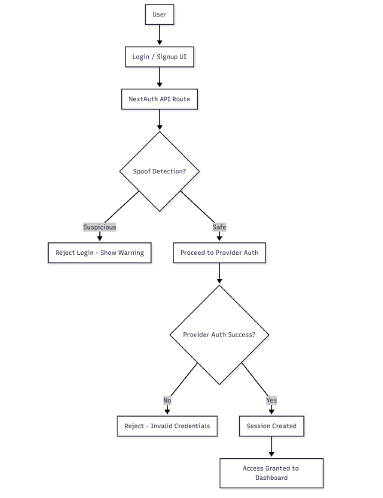
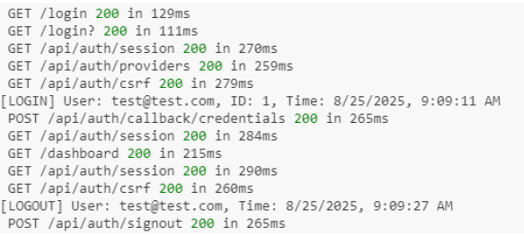
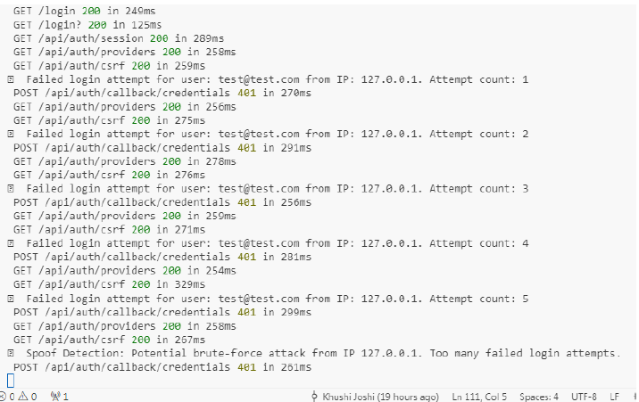

# Secure Login System

The **Secure Login System** is a robust authentication platform designed for modern web applications. It integrates advanced security features to protect sensitive user data and maintain system integrity. The project includes multiple authentication methods, proactive spoof detection, and comprehensive logging for security monitoring.


## Features

- **User Authentication:**  
  Supports multiple login methods: OAuth (Google, GitHub) and traditional email/password.

- **Session Management:**  
  Stateless sessions using JSON Web Tokens (JWT).

- **Spoof Detection:**  
  Detects and mitigates brute-force login attempts using IP-based rate limiting.

- **Audit Logging:**  
  Logs all login/logout events for security monitoring and auditing.

- **Protected Routes:**  
  Ensures sensitive resources are accessible only to authenticated users.


## Technologies / Stack

- **Next.js:** Full-stack framework for server-side rendering and API routes.  
- **NextAuth.js:** Authentication library for OAuth and credentials-based login.  
- **TypeScript:** For static typing and enhanced code reliability.  
- **Prisma:** ORM for database interactions and scalability.  
- **JWT:** For secure, stateless session management.


## Installation / Setup

1. **Clone the repository:**
```bash
git clone https://github.com/khushi-joshi-05/secure-login.git
cd secure-login
````

2. **Install dependencies:**

```bash
npm install
```

3. **Configure environment variables:**
   Add OAuth credentials (Google, GitHub) and database connection details in a `.env` file.

4. **Run the application:**

```bash
npm run dev
```

5. **Access the app:**
   Open [http://localhost:3000](http://localhost:3000) in your browser.


## Usage

* **Signup/Login:**
  Users can sign up or log in using email/password or OAuth providers (Google, GitHub).

* **Dashboard Access:**
  Authenticated users can access the protected dashboard.

* **Spoof Detection:**
  The system blocks IPs with more than 5 failed login attempts within 5 minutes.

* **Audit Logs:**
  Admins can monitor login/logout events for security analysis.


## Project Structure

```
app/: Main application (Next.js App Router)
api/: API routes for authentication
dashboard/: Protected dashboard page
login/: Login page
signup/: Signup page
Components/: Reusable UI components
lib/: Utility functions (NextAuth configuration, Prisma setup)
prisma/: Database schema and migrations
public/: Static assets (images, icons)
types/: TypeScript types and interfaces
```


## Flowchart



**Flow Overview:**

1. Users interact with the login/signup UI.
2. Spoof detection checks for suspicious activity.
3. Successful authentication grants access to the dashboard.
4. All login/logout events are logged for auditing.


## Demo / Screenshots

* **Audit Logs:** Real-time logging of login/logout events, the application logs key activities like signIn and signOut directly to the server console. This provides a real-time record of who logged in and when.
  
* **Spoof Detection Logs:** Tracks failed login attempts and blocks suspicious IPs, allowing cyber security teams to monitor suspicious activities.
  


## Contact
GitHub: [khushi-joshi-05](https://github.com/khushi-joshi-05)  
Email: joshikhushi0005@gmail.com
